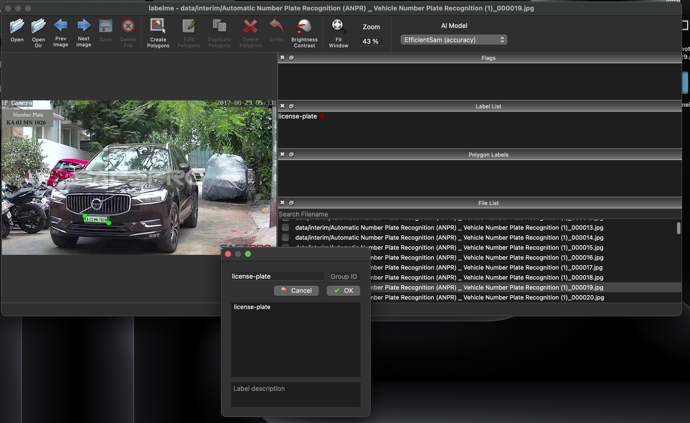
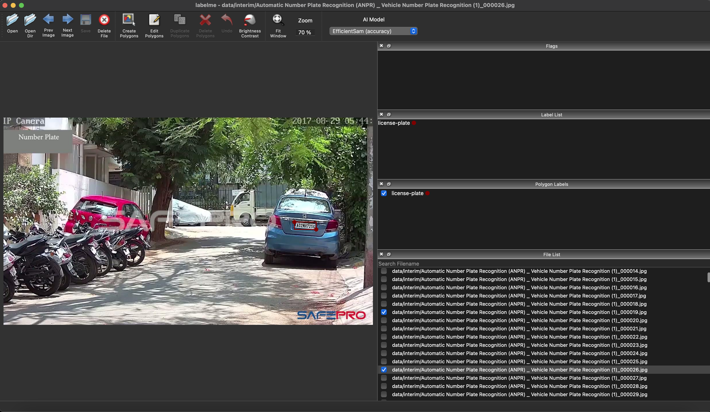

# ANPR-YOLO (Route25 R&D)

This repository is part of the **Route25 WP2 R&D activities**.  
The goal is to explore **vehicle and license plate detection (Automatic Number Plate Recognition – ANPR)** using YOLOv5.  

We integrate YOLOv5 as a **submodule** and add our own dataset preparation scripts, configs, and results.  
This work supports the Route25 mission of advancing intelligent, connected, and AI-driven mobility solutions.

------------------------------------------------------------

## 🔧 Setup

Clone this repo **with submodules**:

    git clone --recurse-submodules git@github.com:mhamdim7/anpr-yolo.git
    cd anpr-yolo

If you already cloned without `--recurse-submodules`:

    git submodule update --init --recursive

Run the setup script (creates venv, installs YOLOv5 + extras, prepares folders):

    bash setup.sh

Activate environment when working:

    source .venv/bin/activate

------------------------------------------------------------

## 📂 Data workflow

1. Place raw videos into `data/raw/`  

2. Extract frames:

       bash scripts/extract_frames.sh

   → outputs `.jpg` frames into `data/interim/`

3. 🖊️ Annotate license plates with **Labelme**:

       labelme data/interim --labels license-plate

   Steps in Labelme:
   - Select the **Rectangle tool (R)** and draw a tight box around each license plate.  
   - When prompted, type the label exactly as: `license-plate`.  
   - Save (`⌘S` on Mac or Save button) → creates a `.json` file next to the image.  
   - Use `D` / `A` to move to next/previous image.  
   - Skip images without visible plates (don’t save JSON).  

   💡 Tips:
   - Always use the label `license-plate` (exact spelling).  
   - Draw tight bounding boxes (less background = better training).  
   - Label multiple plates in an image if they exist.  

   Example screenshots:  
     
     

4. Convert annotations to YOLO format (auto-splits train/val 90/10):

       python scripts/labelme_to_yolo.py

   → fills `data/yolo/images/{train,val}` and `data/yolo/labels/{train,val}`

------------------------------------------------------------

## 🚀 Training

Run from inside YOLOv5:

    cd yolov5
    source ../.venv/bin/activate

    python train.py --data ../configs/anpr_data.yaml \
                    --weights yolov5s.pt \
                    --img 640 --epochs 100 --batch 16 \
                    --project ../results --name yolov5s_lp

------------------------------------------------------------

## 📊 Inference

Example: detect plates on a video

    cd yolov5
    python detect.py --weights ../results/yolov5s_lp/weights/best.pt \
                     --source ../data/raw/example_video.mp4 \
                     --project ../results --name lp_infer \
                     --save-txt --save-conf

Results (annotated images/videos + `.txt` detections) are saved under `results/`.

------------------------------------------------------------

## 🧹 Cleanup

To reset generated data but keep raw videos:

    bash cleanup.sh

Options:  
--dry-run → show what would be removed  
--yes     → skip confirmation  

------------------------------------------------------------

## 📑 Deliverables

- A trained YOLO model for license plate detection (`best.pt`)  
- Annotated results (images/videos with bounding boxes for cars + plates)  
- Report (3–4 pages) with steps, datasets, screenshots, and findings

------------------------------------------------------------

## 🔗 References

- Ultralytics YOLOv5: https://github.com/ultralytics/yolov5  
- ANPR YOLOv5 Example Repo 1: https://github.com/KALYAN1045/Automatic-Number-Plate-Recognition-using-YOLOv5  
- ANPR YOLOv5 Example Repo 2: https://github.com/ashok426/Vehicle-number-plate-recognition-YOLOv5  